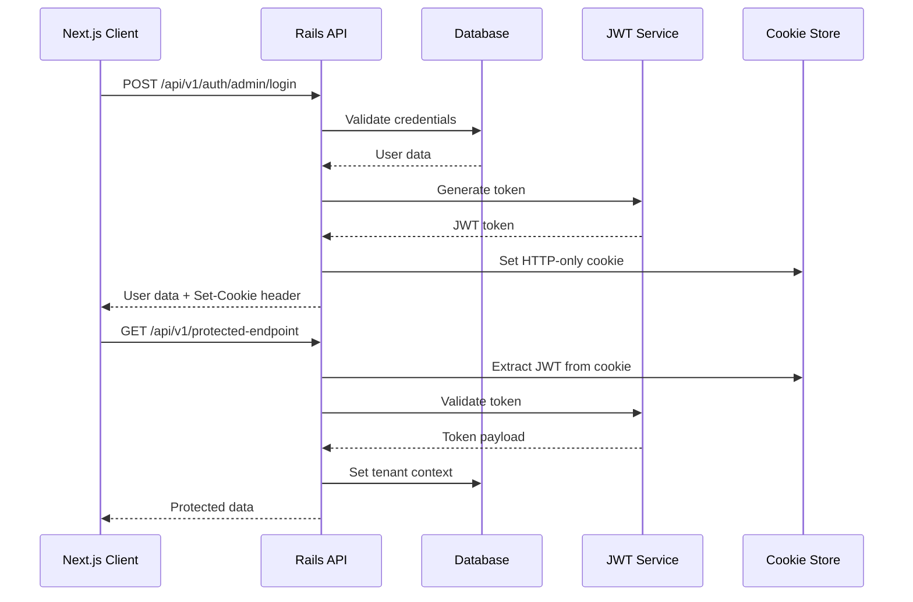
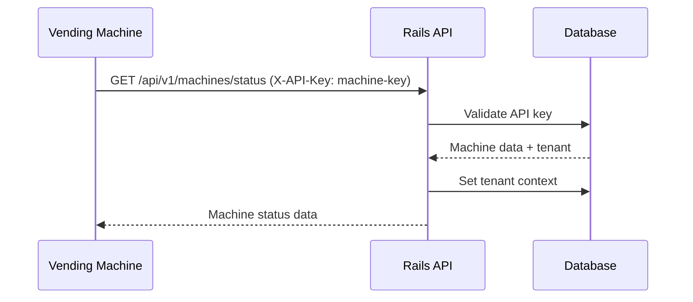
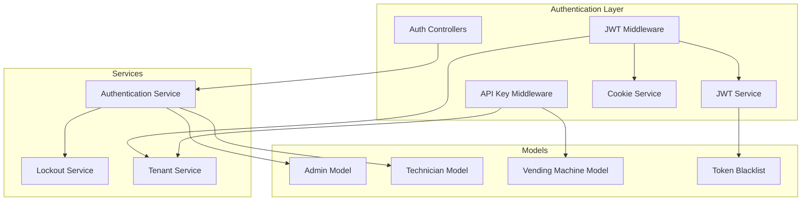

# Custom JWT + Cookies Authentication Design

## Overview

This design implements a custom JWT-based authentication system using HTTP-only cookies for the Autemix Admin Platform. The system provides transparent, controllable authentication with multi-tenancy support, replacing the complex Devise implementation with a clear, maintainable solution.

## Architecture

### High-Level Flow

#### Admin/Technician Authentication Flow


#### Vending Machine Authentication Flow (Existing)


### Component Architecture



## Components and Interfaces

### 1. JWT Service (`app/services/jwt_service.rb`)

Handles all JWT token operations with a clean, testable interface.

```ruby
class JwtService
  def self.encode(payload, expiration = 24.hours.from_now)
  def self.decode(token)
  def self.blacklist_token(token)
  def self.token_blacklisted?(token)
  def self.cleanup_expired_tokens
end
```

**Key Features:**
- Uses Rails credentials for secret key management
- Includes user_id, tenant_id, user_type, and expiration in payload
- Supports token blacklisting for secure logout
- Automatic cleanup of expired blacklisted tokens

### 2. Authentication Service (`app/services/authentication_service.rb`)

Centralizes authentication logic with clear success/failure handling.

```ruby
class AuthenticationService
  def self.authenticate_admin(email, password, ip_address = nil)
  def self.authenticate_technician(email, password, ip_address = nil)
  def self.logout_user(token)
  
  private
  def self.handle_failed_attempt(user, ip_address)
  def self.reset_failed_attempts(user)
  def self.account_locked?(user)
end
```

**Key Features:**
- Handles password verification using bcrypt
- Manages failed attempt tracking and account lockout
- Returns structured response objects with success/failure status
- Logs authentication attempts for security auditing

### 3. Authentication Middleware (`app/middleware/jwt_authentication.rb`)

Provides automatic authentication for protected endpoints while coexisting with API key authentication.

```ruby
class JwtAuthentication
  def initialize(app)
  def call(env)
  
  private
  def extract_token_from_cookies(request)
  def authenticate_request(request)
  def set_current_user_and_tenant(payload)
  def skip_jwt_for_api_key_routes?(request)
  def api_key_authentication_present?(request)
end
```

**Key Features:**
- Extracts JWT from HTTP-only cookies for admin/technician requests
- Validates token signature and expiration
- Sets current_user and tenant context
- Handles authentication errors gracefully
- Skips JWT authentication for /api/v1/machines/* endpoints
- Defers to existing API key authentication when X-API-Key header is present

### 4. Cookie Service (`app/services/cookie_service.rb`)

Manages secure cookie operations with environment-aware settings.

```ruby
class CookieService
  def self.set_auth_cookie(response, token)
  def self.clear_auth_cookie(response)
  def self.cookie_options
  
  private
  def self.secure_cookie_settings
end
```

**Key Features:**
- HTTP-only cookies for XSS protection
- Secure flag for HTTPS in production
- SameSite=Strict for CSRF protection
- Environment-aware configuration

### 5. Enhanced User Models

#### Admin Model (`app/models/admin.rb`)

```ruby
class Admin < ApplicationRecord
  acts_as_tenant :tenant
  has_secure_password
  
  validates :email, presence: true, uniqueness: { scope: :tenant_id }
  validates :first_name, :last_name, presence: true
  validates :password, length: { minimum: 8 }, if: :password_required?
  
  def account_locked?
  def increment_failed_attempts!
  def reset_failed_attempts!
  def lock_account!
  def unlock_account!
end
```

#### Technician Model (`app/models/technician.rb`)

```ruby
class Technician < ApplicationRecord
  acts_as_tenant :tenant
  has_secure_password
  
  validates :email, presence: true, uniqueness: { scope: :tenant_id }
  validates :first_name, :last_name, presence: true
  validates :password, length: { minimum: 8 }, if: :password_required?
  
  def account_locked?
  def increment_failed_attempts!
  def reset_failed_attempts!
  def lock_account!
  def unlock_account!
end
```

**Key Features:**
- Uses `has_secure_password` for bcrypt integration
- Maintains multi-tenant support with acts_as_tenant
- Built-in account lockout functionality
- Clean validation rules

### 6. Redis Token Blacklist Service (`app/services/token_blacklist_service.rb`)

```ruby
class TokenBlacklistService
  def self.blacklist_token(jti, expires_at)
  def self.token_blacklisted?(jti)
  def self.cleanup_expired_tokens
  
  private
  def self.redis_key(jti)
  def self.ttl_for_token(expires_at)
end
```

**Key Features:**
- Uses Redis for fast token blacklist lookups
- Automatic expiration using Redis TTL
- No database storage needed for temporary data
- High performance for authentication checks

## Data Models

### Database Schema Changes

```ruby
# Remove Devise columns from admins and technicians tables
remove_column :admins, :encrypted_password
remove_column :admins, :jti
remove_column :admins, :reset_password_token
remove_column :admins, :reset_password_sent_at
remove_column :admins, :remember_created_at
remove_column :admins, :sign_in_count
remove_column :admins, :current_sign_in_at
remove_column :admins, :last_sign_in_at
remove_column :admins, :current_sign_in_ip
remove_column :admins, :last_sign_in_ip
remove_column :admins, :unlock_token

# Add custom authentication columns
add_column :admins, :password_digest, :string, null: false
add_column :admins, :last_login_at, :datetime
add_column :admins, :last_login_ip, :string

# Note: failed_attempts and locked_at columns are preserved from Devise
# Same changes applied to technicians table

# Token blacklisting handled by Redis - no database table needed
```

### Authentication Flow Data

```ruby
# JWT Payload Structure
{
  user_id: 123,
  tenant_id: 456,
  user_type: 'admin', # or 'technician'
  exp: 1640995200,    # Unix timestamp
  iat: 1640908800,    # Issued at
  jti: 'unique-token-id'
}

# Authentication Response Structure
{
  success: true,
  user: {
    id: 123,
    email: 'admin@example.com',
    first_name: 'John',
    last_name: 'Doe',
    tenant_id: 456,
    user_type: 'admin'
  },
  message: 'Login successful'
}

# Error Response Structure
{
  success: false,
  error: 'invalid_credentials',
  message: 'Invalid email or password',
  attempts_remaining: 3
}
```

## Error Handling

### Authentication Errors

```ruby
class AuthenticationError < StandardError; end
class InvalidCredentialsError < AuthenticationError; end
class AccountLockedError < AuthenticationError; end
class TokenExpiredError < AuthenticationError; end
class TokenInvalidError < AuthenticationError; end
class TenantMismatchError < AuthenticationError; end
```

### Error Response Format

```json
{
  "success": false,
  "error": "account_locked",
  "message": "Account is temporarily locked due to too many failed attempts",
  "details": {
    "locked_until": "2024-01-15T10:30:00Z",
    "attempts_made": 5,
    "max_attempts": 5
  }
}
```

## Testing Strategy

### Unit Tests

1. **JWT Service Tests**
   - Token encoding/decoding
   - Token blacklisting
   - Expiration handling
   - Invalid token scenarios

2. **Authentication Service Tests**
   - Successful authentication
   - Failed authentication
   - Account lockout logic
   - Password validation

3. **Model Tests**
   - Password hashing
   - Validation rules
   - Account lockout methods
   - Multi-tenant scoping

### Integration Tests

1. **Authentication Controller Tests**
   - Login endpoints for both user types
   - Logout functionality
   - Cookie setting/clearing
   - Error response formats

2. **Middleware Tests**
   - Token extraction from cookies
   - Authentication validation
   - Tenant context setting
   - Error handling

3. **End-to-End Authentication Flow**
   - Complete login/logout cycle
   - Protected endpoint access
   - Token expiration handling
   - Multi-tenant scenarios

### Security Tests

1. **Cookie Security**
   - HTTP-only flag verification
   - Secure flag in production
   - SameSite attribute testing

2. **Token Security**
   - JWT signature validation
   - Token blacklisting effectiveness
   - Expiration enforcement

3. **Account Security**
   - Lockout mechanism testing
   - Failed attempt tracking
   - Brute force protection

## Security Considerations

### Token Security
- JWT tokens signed with strong secret key
- Short expiration times (24 hours)
- Token blacklisting for secure logout
- JTI (JWT ID) for unique token identification

### Cookie Security
- HTTP-only cookies prevent XSS attacks
- Secure flag ensures HTTPS-only transmission
- SameSite=Strict prevents CSRF attacks
- Proper expiration matching JWT lifetime

### Account Security
- bcrypt for password hashing with appropriate cost
- Account lockout after failed attempts
- IP address logging for audit trails
- Password complexity requirements

### Multi-Tenant Security
- Tenant context validation on every request
- User-tenant relationship verification
- Tenant isolation in database queries
- Cross-tenant access prevention

### API Key Security (Existing)
- Separate authentication path for vending machines
- API key validation for /api/v1/machines/* endpoints
- Machine-specific tenant context setting
- No interference with JWT authentication flow

## Performance Considerations

### Token Operations
- In-memory caching for frequently accessed tokens
- Efficient blacklist lookup using database indexes
- Automatic cleanup of expired blacklist entries
- Minimal JWT payload size

### Database Optimization
- Indexes on email fields for fast user lookup
- Indexes on tenant_id for multi-tenant queries
- Efficient failed attempt tracking
- Optimized blacklist table structure

### Caching Strategy
- Cache user data after successful authentication
- Cache tenant information for request duration
- Minimize database queries in middleware
- Use Rails cache for token blacklist checks

This design provides a robust, transparent, and maintainable authentication system that gives us full control over the authentication flow while maintaining security best practices and multi-tenant support.