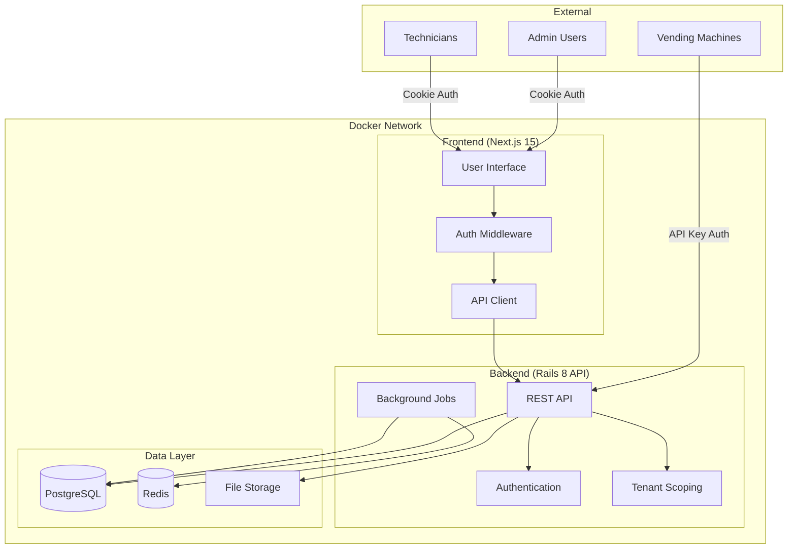

# Design Document

## Overview

The Vending Machine Admin Platform is architected as a Backend-for-Frontend (BFF) system with clear separation between API and presentation layers. The system employs a monorepo structure containing a Ruby on Rails 8 API-only backend and a Next.js 15 frontend application, orchestrated via Docker Compose for consistent development and deployment.

The platform implements multi-tenancy at the database level with automatic scoping, role-based authentication supporting both cookie sessions and API keys, and real-time inventory management with automated alerting capabilities.

## Architecture

### System Architecture



### Multi-Tenant Architecture

The system implements tenant isolation using the `acts_as_tenant` gem with automatic scoping:

- **Tenant Resolution**: Via subdomain (tenant1.domain.com) or custom header
- **Data Scoping**: All models automatically scoped to current tenant
- **Request Context**: Tenant context established at middleware level
- **Security**: Cross-tenant access prevention with audit logging

### Authentication Architecture

**Cookie-Based Authentication (Admin/Technician)**:
- Rails Devise with secure session cookies
- HttpOnly, Secure, SameSite=Strict configuration
- SSR-compatible authentication state
- Automatic session refresh and timeout handling

**API Key Authentication (Vending Machines)**:
- Unique encrypted API keys per machine
- Custom middleware for API key validation
- Rate limiting and request logging
- Key rotation capabilities

## Components and Interfaces

### Backend Components

#### Authentication System
```ruby
# Authentication middleware stack
class ApiKeyAuthenticationMiddleware
  # Validates machine API keys
  # Sets current_machine context
  # Logs authentication attempts
end

class TenantMiddleware
  # Resolves tenant from subdomain/header
  # Sets ActsAsTenant.current_tenant
  # Handles tenant switching
end
```

#### Core Services
```ruby
class InventoryService
  # Handles stock updates and validation
  # Triggers low stock alerts
  # Manages inventory transactions
end

class AlertService
  # Generates system alerts
  # Manages alert priorities
  # Triggers notification jobs
end

class MaintenanceScheduler
  # Calculates maintenance due dates
  # Generates scheduled maintenance alerts
  # Tracks service intervals
end
```

#### Background Job System
```ruby
class AlertNotificationJob < ApplicationJob
  # Sends email notifications for alerts
  # Handles notification preferences
  # Manages delivery retries
end

class MachineHealthCheckJob < ApplicationJob
  # Monitors machine heartbeats
  # Generates offline alerts
  # Updates machine status
end
```

### Frontend Components

#### Authentication Flow
```typescript
// Authentication middleware
export async function middleware(request: NextRequest) {
  const session = await getSession(request)
  if (!session && isProtectedRoute(request.nextUrl.pathname)) {
    return NextResponse.redirect(new URL('/login', request.url))
  }
}

// Session management
class AuthService {
  async login(credentials: LoginCredentials): Promise<User>
  async logout(): Promise<void>
  async getCurrentUser(): Promise<User | null>
  async refreshSession(): Promise<boolean>
}
```

#### Core UI Components
```typescript
// Dashboard components
interface DashboardProps {
  machines: VendingMachine[]
  alerts: Alert[]
  user: User
}

// Machine management
interface MachineCardProps {
  machine: VendingMachine
  onUpdate: (machine: VendingMachine) => void
  onViewDetails: (machineId: string) => void
}

// Inventory management
interface InventoryGridProps {
  items: InventoryItem[]
  onUpdateStock: (itemId: string, quantity: number) => void
  readonly?: boolean
}
```

## Data Models

### Core Models

#### Tenant Model
```ruby
class Tenant < ApplicationRecord
  has_many :admins, dependent: :destroy
  has_many :technicians, dependent: :destroy
  has_many :vending_machines, dependent: :destroy
  has_many :perfumes, dependent: :destroy
  
  validates :name, presence: true, uniqueness: true
  validates :subdomain, presence: true, uniqueness: true, format: { with: /\A[a-z0-9\-]+\z/ }
end
```

#### User Models
```ruby
class Admin < ApplicationRecord
  acts_as_tenant(:tenant)
  devise :database_authenticatable, :registerable, :recoverable, :rememberable, :validatable
  
  belongs_to :tenant
  has_many :maintenance_logs, foreign_key: 'performed_by_id'
  
  enum role: { super_admin: 0, admin: 1 }
end

class Technician < ApplicationRecord
  acts_as_tenant(:tenant)
  devise :database_authenticatable, :recoverable, :rememberable, :validatable
  
  belongs_to :tenant
  has_many :maintenance_logs, foreign_key: 'performed_by_id'
end
```

#### Machine and Inventory Models
```ruby
class VendingMachine < ApplicationRecord
  acts_as_tenant(:tenant)
  
  belongs_to :tenant
  has_many :inventory_items, dependent: :destroy
  has_many :sale_logs, dependent: :destroy
  has_many :maintenance_logs, dependent: :destroy
  has_many :alerts, dependent: :destroy
  
  validates :name, presence: true
  validates :location, presence: true
  validates :api_key_encrypted, presence: true, uniqueness: true
  
  encrypts :api_key
  
  scope :online, -> { where('last_ping_at > ?', 5.minutes.ago) }
  scope :offline, -> { where('last_ping_at <= ? OR last_ping_at IS NULL', 5.minutes.ago) }
end

class InventoryItem < ApplicationRecord
  acts_as_tenant(:tenant)
  
  belongs_to :vending_machine
  belongs_to :perfume
  
  validates :quantity, presence: true, numericality: { greater_than_or_equal_to: 0 }
  validates :low_stock_threshold, presence: true, numericality: { greater_than: 0 }
  
  scope :low_stock, -> { where('quantity <= low_stock_threshold') }
end
```

#### Transaction and Maintenance Models
```ruby
class SaleLog < ApplicationRecord
  acts_as_tenant(:tenant)
  
  belongs_to :vending_machine
  belongs_to :perfume
  
  validates :quantity_sold, presence: true, numericality: { greater_than: 0 }
  validates :remaining_stock, presence: true, numericality: { greater_than_or_equal_to: 0 }
  validates :timestamp, presence: true
end

class MaintenanceLog < ApplicationRecord
  acts_as_tenant(:tenant)
  
  belongs_to :vending_machine
  belongs_to :performed_by, polymorphic: true # Admin or Technician
  
  has_many_attached :photos
  
  validates :maintenance_type, presence: true
  validates :timestamp, presence: true
  validates :cost, numericality: { greater_than_or_equal_to: 0 }, allow_nil: true
  
  enum maintenance_type: { inspection: 0, repair: 1, refill: 2, cleaning: 3 }
end
```

#### Alert System Model
```ruby
class Alert < ApplicationRecord
  acts_as_tenant(:tenant)
  
  belongs_to :vending_machine
  
  validates :alert_type, presence: true
  validates :message, presence: true
  validates :priority, presence: true
  
  enum alert_type: { low_stock: 0, machine_offline: 1, maintenance_due: 2, maintenance_overdue: 3 }
  enum priority: { low: 0, medium: 1, high: 2, critical: 3 }
  
  scope :unread, -> { where(read_at: nil) }
  scope :by_priority, -> { order(:priority) }
end
```

### Database Schema Considerations

- **Indexing Strategy**: Composite indexes on tenant_id + frequently queried fields
- **Partitioning**: Consider partitioning large tables (sale_logs) by date
- **Constraints**: Foreign key constraints with CASCADE options for tenant cleanup
- **Encryption**: Sensitive data (API keys) encrypted at rest using Rails 7+ encryption

## Error Handling

### API Error Response Format
```json
{
  "error": {
    "code": "VALIDATION_ERROR",
    "message": "The request contains invalid data",
    "details": {
      "field_errors": {
        "email": ["is required", "must be valid email format"],
        "quantity": ["must be greater than 0"]
      }
    },
    "request_id": "req_123456789"
  }
}
```

### Error Categories and Handling

#### Authentication Errors
- **401 Unauthorized**: Invalid credentials or expired session
- **403 Forbidden**: Insufficient permissions for requested resource
- **429 Too Many Requests**: Rate limiting exceeded

#### Validation Errors
- **422 Unprocessable Entity**: Invalid input data with detailed field errors
- **400 Bad Request**: Malformed request structure

#### System Errors
- **500 Internal Server Error**: Unexpected system errors with request tracking
- **503 Service Unavailable**: Temporary system maintenance or overload

### Frontend Error Handling
```typescript
class ApiError extends Error {
  constructor(
    public status: number,
    public code: string,
    message: string,
    public details?: any
  ) {
    super(message)
  }
}

class ErrorHandler {
  static handle(error: ApiError): void {
    switch (error.status) {
      case 401:
        // Redirect to login
        break
      case 403:
        // Show permission denied message
        break
      case 422:
        // Display validation errors
        break
      default:
        // Show generic error message
    }
  }
}
```

## Testing Strategy

### Backend Testing

#### Unit Tests (RSpec)
```ruby
# Model testing with FactoryBot
RSpec.describe VendingMachine, type: :model do
  it_behaves_like 'acts_as_tenant'
  
  describe 'validations' do
    it { should validate_presence_of(:name) }
    it { should validate_presence_of(:location) }
  end
  
  describe 'scopes' do
    it 'returns online machines' do
      online_machine = create(:vending_machine, last_ping_at: 1.minute.ago)
      offline_machine = create(:vending_machine, last_ping_at: 10.minutes.ago)
      
      expect(VendingMachine.online).to include(online_machine)
      expect(VendingMachine.online).not_to include(offline_machine)
    end
  end
end
```

#### Integration Tests
```ruby
# API endpoint testing
RSpec.describe 'Vending Machines API', type: :request do
  let(:tenant) { create(:tenant) }
  let(:admin) { create(:admin, tenant: tenant) }
  
  before { sign_in admin }
  
  describe 'GET /api/v1/vending_machines' do
    it 'returns tenant-scoped machines' do
      machine = create(:vending_machine, tenant: tenant)
      other_tenant_machine = create(:vending_machine)
      
      get '/api/v1/vending_machines'
      
      expect(response).to have_http_status(:ok)
      expect(json_response['data']).to include(hash_including('id' => machine.id.to_s))
      expect(json_response['data']).not_to include(hash_including('id' => other_tenant_machine.id.to_s))
    end
  end
end
```

### Frontend Testing

#### Component Testing (Jest + React Testing Library)
```typescript
// Component unit tests
describe('MachineCard', () => {
  const mockMachine = {
    id: '1',
    name: 'Machine 1',
    location: 'Building A',
    status: 'online',
    lastPingAt: new Date().toISOString()
  }
  
  it('displays machine information correctly', () => {
    render(<MachineCard machine={mockMachine} />)
    
    expect(screen.getByText('Machine 1')).toBeInTheDocument()
    expect(screen.getByText('Building A')).toBeInTheDocument()
    expect(screen.getByText('Online')).toBeInTheDocument()
  })
  
  it('shows offline status for machines without recent ping', () => {
    const offlineMachine = {
      ...mockMachine,
      lastPingAt: new Date(Date.now() - 10 * 60 * 1000).toISOString() // 10 minutes ago
    }
    
    render(<MachineCard machine={offlineMachine} />)
    expect(screen.getByText('Offline')).toBeInTheDocument()
  })
})
```

#### End-to-End Testing (Playwright)
```typescript
// E2E authentication flow
test('admin can login and view dashboard', async ({ page }) => {
  await page.goto('/login')
  
  await page.fill('[data-testid="email"]', 'admin@example.com')
  await page.fill('[data-testid="password"]', 'password')
  await page.click('[data-testid="login-button"]')
  
  await expect(page).toHaveURL('/dashboard')
  await expect(page.locator('[data-testid="machine-grid"]')).toBeVisible()
})
```

### Testing Data Management
- **FactoryBot**: Consistent test data generation with tenant scoping
- **Database Cleaner**: Proper test isolation between specs
- **VCR**: HTTP interaction recording for external API testing
- **Test Containers**: Isolated database instances for integration tests

This design provides a robust foundation for the vending machine admin platform with clear separation of concerns, comprehensive error handling, and thorough testing strategies. The architecture supports the multi-tenant requirements while maintaining security and performance standards.